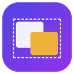
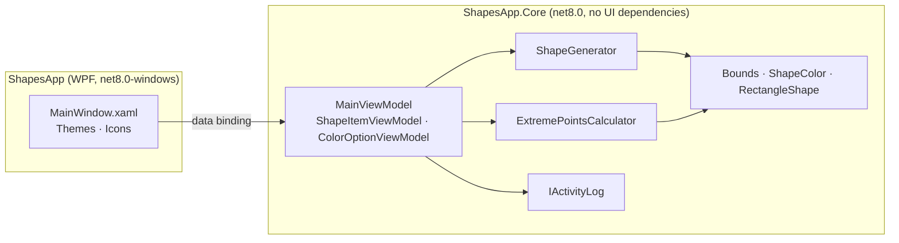

<div align="center">



# ShapesApp

**An interactive WPF app that finds the extreme points of a set of rectangles, with outlier and color filters.**

[](https://github.com/Staery/ShapesApp/actions/workflows/ci.yml)


[](LICENSE)

**English** · [Русский](README.ru.md)

</div>

---

ShapesApp generates random colored rectangles around a **main area**. It then finds the **extreme points** of the
rectangles you choose (the left-, right-, top- and bottom-most edges) and draws the bounding box that passes through
them. Filters let you leave out rectangles that stick out of the main area, or restrict the calculation to certain
colors. The result updates the moment you change a filter.

<!-- Add a screenshot of the running app here, e.g. docs/screenshot.png -->

## ✨ Features

| | |
|---|---|
| 🎲 **Shape generator** | 1–30 rectangles with random positions and sizes, colored with evenly spaced hues so every color is easy to tell apart |
| 📦 **Extreme points** | Bounding box of the selected rectangles with its four corner points marked, plus exact coordinates and size |
| 🚫 **Outlier filter** | Leaves out rectangles that are not completely inside the main area |
| 🎨 **Color filter** | *Ignore colors*, *Only selected* or *All except selected*, with a separate checkbox for every color |
| ⚡ **Live updates** | The box is recalculated as soon as you change a filter. Rectangles that are left out fade |
| 🖱 **Details on hover** | Each rectangle shows its number, color, coordinates and size in a tooltip |
| 🧾 **Activity log** | Actions are written to `%LOCALAPPDATA%\ShapesApp\activity.log` |
| ⌨️ **Shortcuts** | `Ctrl+G` generates a new set, `Ctrl+H` highlights the extreme points |

## 🧱 Tech stack

| Area | Technology |
|---|---|
| Runtime | .NET 8, C# 12 (nullable reference types, records, primary constructors) |
| UI | WPF: `Viewbox`-scaled canvas, data templates, triggers, a custom theme and vector icons |
| Architecture | MVVM with [CommunityToolkit.Mvvm](https://learn.microsoft.com/dotnet/communitytoolkit/mvvm/) source generators |
| Tests | xUnit, 38 tests covering geometry, the generator, the calculator and the view model |
| CI/CD | GitHub Actions: build, test and a self-contained single-file `.exe` |

## 🏗 Architecture



- **Geometry has no UI dependencies.** `Bounds`, `Point2D` and `ShapeColor` are immutable `record struct` types and
  do not depend on `System.Windows`, so all of the logic is unit-tested and also builds on Linux and macOS.
- **The calculation is a pure function.** `ExtremePointsCalculator.Calculate(shapes, mainArea, options)` returns the
  bounding box and the list of rectangles it used. If no rectangle matches, it returns `null` instead of an
  "infinite" rectangle.
- **Generation is reproducible.** `ShapeGenerator` takes a `Random` instance, so tests use a fixed seed.

### How the extreme points are found

```
included = shapes where (not excludeOutliers or mainArea.Contains(shape))
                  and colorFilter(shape.Color)
box      = union of the bounds of all included shapes   // min Left/Top, max Right/Bottom
```

### Project layout

```
ShapesApp/
├── src/
│   ├── ShapesApp/              # WPF application: window, theme, icons
│   └── ShapesApp.Core/
│       ├── Geometry/           # Bounds, Point2D, ShapeColor, RectangleShape
│       ├── Services/           # ShapeGenerator, ExtremePointsCalculator, activity log
│       └── ViewModels/         # MainViewModel and item view models
├── tests/ShapesApp.Core.Tests/ # xUnit tests
└── .github/workflows/ci.yml
```

## 🛠 Fixes compared to the first version

- Highlighting no longer **deletes the main rectangle**. Previously the bounding box shared the main rectangle's tag,
  so the first click removed the main rectangle instead of the old box.
- The main rectangle is no longer **counted as a shape**, so the box is no longer always at least as large as the main
  area.
- When nothing matches the filters, the app **says so** instead of drawing a polygon at `±double.MaxValue`.
- Colors are passed as typed values instead of being converted to text and parsed back.
- The log is written to the user's application data folder instead of the current working directory.

## 🚀 Getting started

Requirements: Windows 10/11 and the [.NET 8 SDK](https://dotnet.microsoft.com/download/dotnet/8.0) (or Visual Studio
2022 with the *.NET desktop development* workload).

```bash
git clone https://github.com/Staery/ShapesApp.git
cd ShapesApp
dotnet run --project src/ShapesApp
```

```bash
dotnet test tests/ShapesApp.Core.Tests     # runs on any OS
```

Build a single-file executable:

```bash
dotnet publish src/ShapesApp -c Release -r win-x64 --self-contained -p:PublishSingleFile=true -o publish
```

## 📄 License

[MIT](LICENSE) © 2024 Selkin Anton Olegovich
