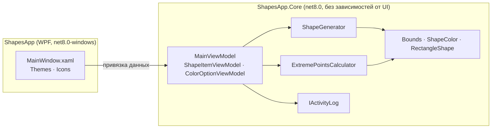

<div align="center">


# ShapesApp

**Интерактивное WPF-приложение, которое находит крайние точки набора прямоугольников с учётом выбросов и фильтра по цвету.**

[](https://github.com/Staery/ShapesApp/actions/workflows/ci.yml)


[](LICENSE)

[English](README.md) · **Русский**

</div>

---

ShapesApp генерирует случайные цветные прямоугольники вокруг **основной области**. Затем приложение находит
**крайние точки** выбранных прямоугольников (самые левые, правые, верхние и нижние границы) и рисует проходящую через
них ограничивающую рамку. Фильтры позволяют не учитывать прямоугольники, которые выходят за основную область, или
оставить в расчёте только определённые цвета. Результат пересчитывается сразу при любом изменении фильтров.

<!-- Добавьте сюда скриншот работающего приложения, например docs/screenshot.png -->

## ✨ Возможности

| | |
|---|---|
| 🎲 **Генератор фигур** | От 1 до 30 прямоугольников со случайным положением и размером. Оттенки равномерно разнесены по цветовому кругу, поэтому цвета легко различить |
| 📦 **Крайние точки** | Ограничивающая рамка выбранных прямоугольников с отмеченными угловыми точками, точными координатами и размером |
| 🚫 **Фильтр выбросов** | Не учитывает прямоугольники, которые не помещаются в основную область целиком |
| 🎨 **Фильтр по цвету** | Режимы *не учитывать цвета*, *только выбранные* и *все, кроме выбранных*, у каждого цвета свой флажок |
| ⚡ **Мгновенный пересчёт** | Рамка пересчитывается сразу при изменении фильтров. Неучтённые прямоугольники становятся полупрозрачными |
| 🖱 **Подсказки** | При наведении на прямоугольник видны его номер, цвет, координаты и размер |
| 🧾 **Журнал действий** | Действия записываются в `%LOCALAPPDATA%\ShapesApp\activity.log` |
| ⌨️ **Горячие клавиши** | `Ctrl+G` создаёт новый набор, `Ctrl+H` показывает крайние точки |

## 🧱 Технологии

| Область | Технологии |
|---|---|
| Платформа | .NET 8, C# 12 (nullable reference types, records, primary constructors) |
| Интерфейс | WPF: холст, масштабируемый через `Viewbox`, шаблоны данных, триггеры, собственная тема и векторные иконки |
| Архитектура | MVVM на [CommunityToolkit.Mvvm](https://learn.microsoft.com/dotnet/communitytoolkit/mvvm/) с генераторами исходного кода |
| Тесты | xUnit, 38 тестов: геометрия, генератор, расчёт и ViewModel |
| CI/CD | GitHub Actions: сборка, тесты и самодостаточный `.exe` из одного файла |

## 🏗 Архитектура



- **Геометрия не зависит от интерфейса.** `Bounds`, `Point2D` и `ShapeColor` — неизменяемые `record struct` без
  зависимости от `System.Windows`. Поэтому вся логика покрыта модульными тестами и собирается даже на Linux и macOS.
- **Расчёт — чистая функция.** `ExtremePointsCalculator.Calculate(shapes, mainArea, options)` возвращает рамку и
  список учтённых прямоугольников. Если ни один прямоугольник не подошёл, возвращается `null`, а не «бесконечный»
  прямоугольник.
- **Генерация воспроизводима.** `ShapeGenerator` принимает экземпляр `Random`, поэтому в тестах используется
  фиксированный seed.

### Как находятся крайние точки

```
included = фигуры, где (не excludeOutliers или mainArea.Contains(фигура))
                    и colorFilter(фигура.Color)
box      = объединение границ всех учтённых фигур   // min Left/Top, max Right/Bottom
```

### Структура проекта

```
ShapesApp/
├── src/
│   ├── ShapesApp/              # WPF-приложение: окно, тема, иконки
│   └── ShapesApp.Core/
│       ├── Geometry/           # Bounds, Point2D, ShapeColor, RectangleShape
│       ├── Services/           # ShapeGenerator, ExtremePointsCalculator, журнал действий
│       └── ViewModels/         # MainViewModel и ViewModel элементов
├── tests/ShapesApp.Core.Tests/ # Тесты xUnit
└── .github/workflows/ci.yml
```

## 🛠 Исправления по сравнению с первой версией

- Кнопка подсветки больше **не удаляет основной прямоугольник**. Раньше у рамки был тот же тег, что и у основного
  прямоугольника, поэтому при первом нажатии удалялся основной прямоугольник, а не старая рамка.
- Основной прямоугольник больше **не учитывается как фигура**, поэтому рамка больше не бывает всегда не меньше
  основной области.
- Если ни одна фигура не подошла под фильтры, приложение **сообщает об этом**, а не рисует полигон с координатами
  `±double.MaxValue`.
- Цвета передаются как типизированные значения, а не преобразуются в текст и обратно.
- Журнал пишется в папку данных пользователя, а не в текущую рабочую папку.

## 🚀 Быстрый старт

Нужны Windows 10/11 и [.NET 8 SDK](https://dotnet.microsoft.com/download/dotnet/8.0) (или Visual Studio 2022 с
рабочей нагрузкой *.NET desktop development*).

```bash
git clone https://github.com/Staery/ShapesApp.git
cd ShapesApp
dotnet run --project src/ShapesApp
```

```bash
dotnet test tests/ShapesApp.Core.Tests     # работает на любой ОС
```

Собрать один исполняемый файл:

```bash
dotnet publish src/ShapesApp -c Release -r win-x64 --self-contained -p:PublishSingleFile=true -o publish
```

## 📄 Лицензия

[MIT](LICENSE) © 2024 Selkin Anton Olegovich
